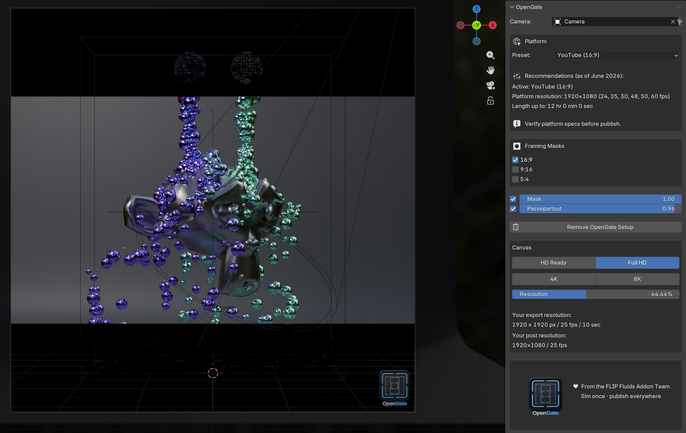
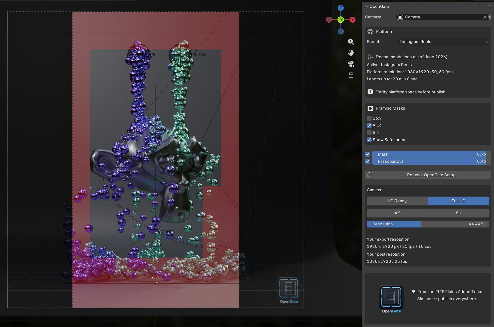

# OpenGate

**Version 0.3.0**

OpenGate is a Blender extension for **composing** social-media content — not for rendering platform-ready files or applying channel-specific render settings.

It sets a square **Open Gate** master resolution and uses viewport masks to show how your shot would look on the channels you care about. Platform presets add delivery hints (resolution, frame rate, length) and spell out the **post crop size** for each format, so you know what to export and how to cut it later.

The idea is simple: frame once in Blender, render one square master, then crop in post for YouTube, Reels, Stories, feed, and more — without rebuilding the composition for every aspect ratio.

## Screenshots

**16:9 landscape framing**



**9:16 portrait framing (with safe zones)**



## Requirements

- Blender **5.1+** — developed and tested on 5.1; older versions have not been tested.

## Installation

1. Download or clone this repository.
2. Install as a local extension (Blender **Edit → Preferences → Get Extensions → Install from Disk**)  
   **or** copy the `opengate` folder into your Blender extensions directory, for example:  
   `Blender/5.1/extensions/user_default/opengate`
3. Enable **OpenGate** in Preferences → Extensions.

## Quick start

1. Open the **OpenGate** sidebar panel in the 3D Viewport.
2. Assign a **Camera**.
3. Choose a **Platform** preset (or toggle framing masks manually).
4. For 9:16 platforms: optional **Show Safezones** (Instagram, YouTube, TikTok, Facebook Reels).
5. Set **Canvas** resolution for your square master render.
6. Press **NumPad 0** — the camera view shows the active mask as a background image.

## Platform presets

Choose a **Platform** preset in the OpenGate panel to apply the matching framing masks and see delivery recommendations — resolution, suggested frame rates, and maximum length — for that destination.

The specs live in `assets/platform_presets.json`. We review platform changes regularly and update the repository accordingly; you can edit that file locally if you need different values in the meantime. Always confirm current platform requirements before you publish.

## Project layout

```
opengate/
├── LICENSE
├── blender_manifest.toml
├── __init__.py
├── properties.py, prefs.py
├── core/
├── operators/, ui/
├── docs/screenshots/   # README images
└── assets/
    ├── platform_presets.json
    ├── masks/          # aspect-ratio and safezone PNGs
    └── shader/         # image-collector blend
```

## License

Copyright © 2026 Ryan Guy & Dennis Fassbaender.

OpenGate is free software: you can redistribute it and/or modify it under the terms of the [GNU General Public License v3.0 or later](LICENSE) (SPDX: `GPL-3.0-or-later`).

This applies to the source code and to bundled assets in this repository (mask images, logo, shader blend), unless noted otherwise.

OpenGate is distributed in the hope that it will be useful, but **without any warranty**; without even the implied warranty of merchantability or fitness for a particular purpose. See the [full GPL text](LICENSE) or [gnu.org/licenses/gpl-3.0.html](https://www.gnu.org/licenses/gpl-3.0.html).

## Developers

**Ryan Guy & Dennis Fassbaender**  
Contact: [support@flipfluids.com](mailto:support@flipfluids.com) · [flipfluids.com](https://flipfluids.com/)

Concept, mask assets, and architecture are original work by the FLIP Fluids team.

<sub>Python source was authored with AI assistance.</sub>
